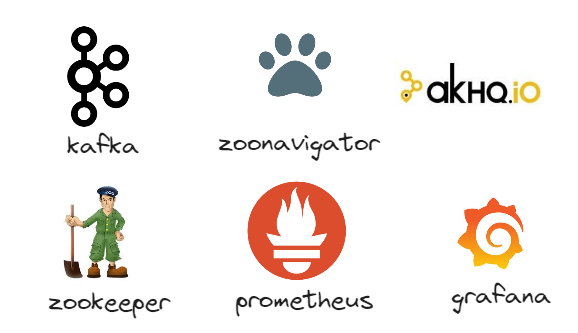

# Lab Eda


### Disclaimer
> **As configurações dos Laboratórios é puramente para fins de desenvolvimento local e estudos**


### Pré-requisitos?
* Docker
* Docker-Compose


## Instalação Kafka 



Executando o docker compose

```
cd ambiente

docker-compose up -d grafana prometheus jmx-kafka-broker zookeeper kafka-broker zoonavigator akhq

```

Verificando se os containers foram criados com sucesso

```
 docker container ls
```
Verificando as imagens que foram feitas download do docker-hub
```
 docker image ls
```

## O que acontenceu ?


## Acesso WebUI dos componentes


* AKHQ http://localhost:8080/ui
* ZooNavigator http://localhost:8000/
* Prometeus http://localhost:9090/
* jmx-prometheus-exporter http://localhost:5556/
* Grafana http://localhost:3000/login

## Acessos

ZooNavigator

```
zookeeper:2181
```

Grafana

* user : `admin`
* password : `kafka`

---

* 3.1. [LAB EDA - API](kafka-net/README.md)
* 3.2. [LAB EDA - AsyncAPI](asyncAPI/README.md)
* 3.3. [LAB EDA - Event-Catalog](event-catalog//README.md)
* 3.4. [LAB EDA - Microcks](microcks/README.md)
* 3.5. [LAB EDA - Kafka Conect](kafka-conect/README.md)
* 3.6. [LAB EDA - Jaeger](jaeger/README.md)
* 3.7. [LAB EDA - Keda](keda/README.md)
* 3.8. [LAB EDA - Kubernetes Kafka](kubernetes-kafka/README.md)
* 3.9. [LAB EDA - Ksqldb](ksqldb/README.md)