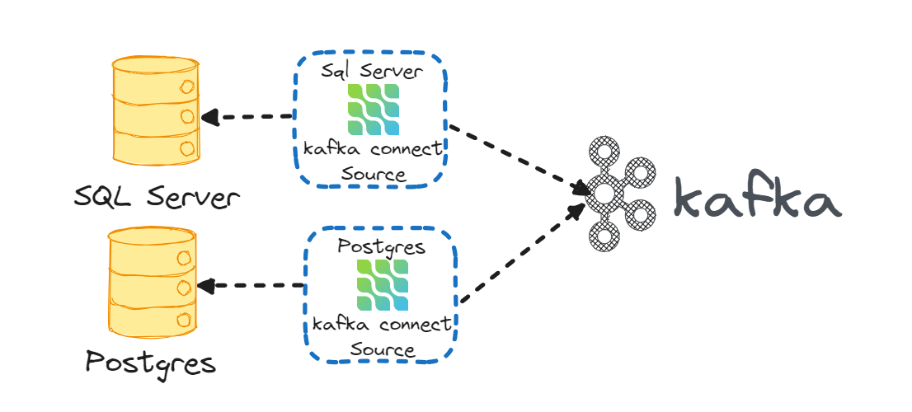
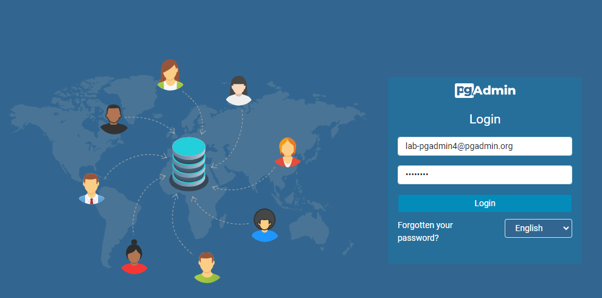
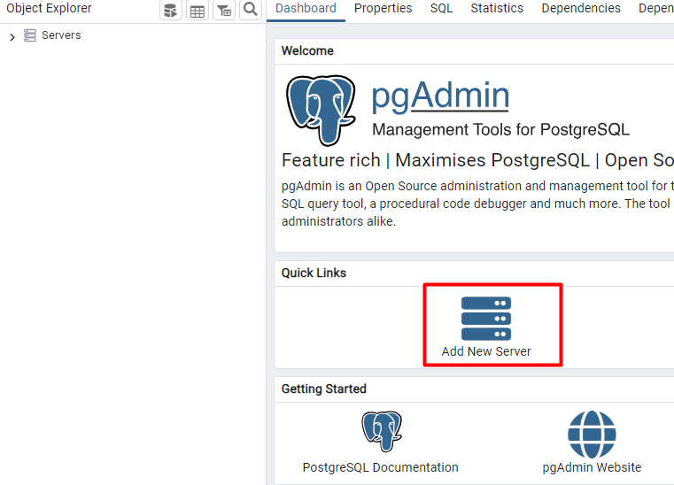
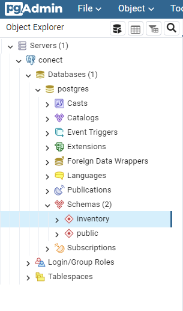
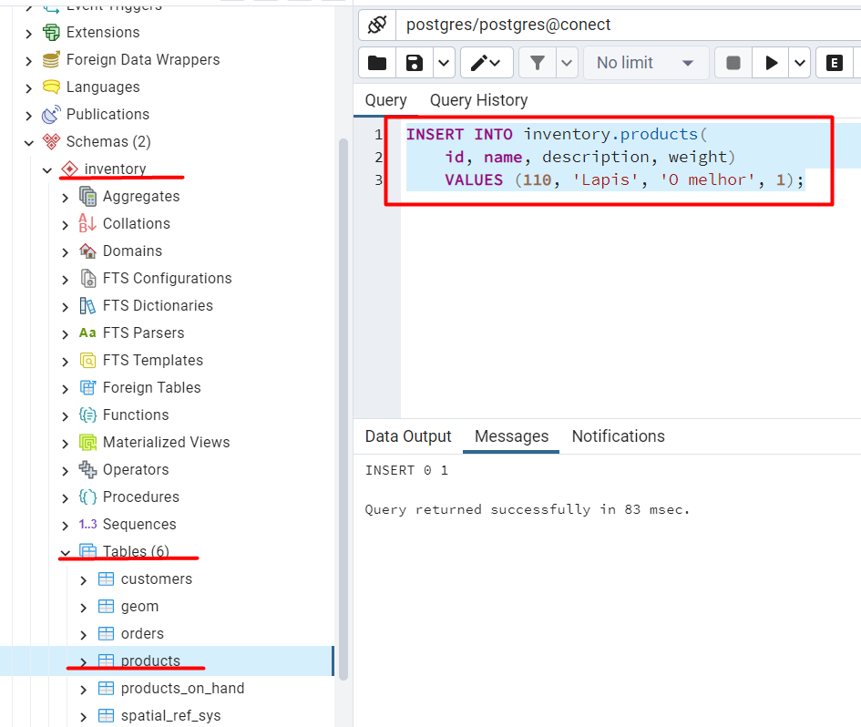
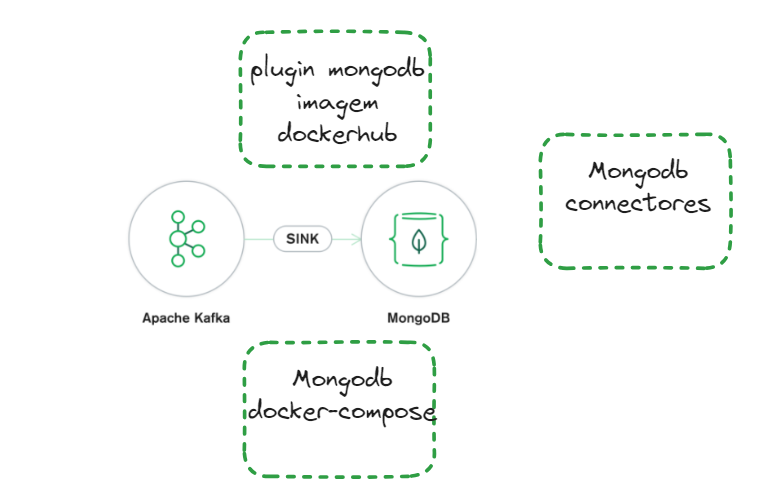

# Lab Eda - Kafka Connect


## Disclaimer
> **As configurações dos Laboratórios é puramente para fins de desenvolvimento local e estudos**


## Pré-requisitos?
* Docker
* Docker-Compose


# Instalação Kafka 

[LAB EDA](lab-eda//README.md)


## Kafka Connect




### Realizando download dos plugins Debezium Sql Server e PostGres (Source) 

```
cd kafka-conect

mkdir plugin

curl https://repo1.maven.org/maven2/io/debezium/debezium-connector-sqlserver/1.6.2.Final/debezium-connector-sqlserver-1.6.2.Final-plugin.tar.gz | tar xvz -C plugin

curl -sfSL https://repo1.maven.org/maven2/io/debezium/debezium-connector-postgres/2.1.3.Final/debezium-connector-postgres-2.1.3.Final-plugin.tar.gz | tar xz -C plugin

```

Criando a imagem junto com os plugins


```
 docker image build -t <<usuario>>/kafka-connet-debezium-lab  -f Dockerfile .
 
```

Vamos enviar a imagem para o dockerhub ??

```
docker image push <<conta>>/kafka-connet-debezium-lab
```

> As imagens customizadas encontra-se no https://hub.docker.com/

### Subindo um cluster kafka connect


```
cd ..
cd ambiente
docker-compose up -d kafka-broker zk connect 
```

Container  criado? Vamos ver!

```
docker container ls
```

Listando os plugins existente, os defaults da imagem e os debezium que foi inserido na imagem, via Dockerfile

```
docker exec -it kafkaConect curl  http://localhost:8083/connector-plugins
```

## Configurando os Conectores SQL e Postgres

### Configurando Banco de dados CDC para SQL

Será utilizado o connector debezium para sql server, ele faz a leitura do banco de dados via CDC.

> Para nossa exemplo iremos subir um banco de dados, caso já tenha um banco habilitado o CDC pode-se usar ele. Mais detalhes do que é Sql Server CDC, https://docs.microsoft.com/pt-br/sql/relational-databases/track-changes/about-change-data-capture-sql-server?view=sql-server-ver15

```
docker-compose up -d sqlserver
```

Para esse tutorial vamos utilizar a imagem sql server da Microsoft `mcr.microsoft.com/mssql/server:2019-latest`. Para criar a estrutura dos dados estou utilizando o próprio container criado.

>O arquivo para habilitar CDC e criar o banco de dados, as tabelas e popular com alguns dados está em sql/init.sql que foi executado via Microsoft SQL Server Management Studio ou você pode executar pelo próprio pod conforme código abaixo

Executando os scripts

```
export  SA_PASSWORD=Password!
cat sql/init.sql | docker exec -i sqlserver /opt/mssql-tools/bin/sqlcmd -U sa -P $SA_PASSWORD

docker exec -i sqlserver /opt/mssql-tools/bin/sqlcmd -U sa -P $SA_PASSWORD -d dbEcommerce -Q "select * from produtos"

docker exec -i sqlserver /opt/mssql-tools/bin/sqlcmd -U sa -P $SA_PASSWORD -d dbEcommerce -Q "INSERT INTO produtos(nome,descricao)  VALUES ('Lapis','lapis de escrever');"

```

### Provisionando Banco de dados Postgres e PgAdmin

```
docker-compose up -d postgres pgadmin
```

Acesso o PgAdmin http://localhost:5433/


* Login: lab-pgadmin4@pgadmin.org
* Senha : postgres    


### Tela de login do PgAdmin



### Inserindo um server


### Configurando o server


### ...Se tudo deu certo o banco de exemplo com suas tabelas


### Criando os Conectores

*API rest do kafka Connect*
https://docs.confluent.io/platform/current/connect/references/restapi.html


Criando o conector PostGres

```
cd ..
cd kafka-conect

http PUT http://localhost:8083/connectors/connector-postgres/config < conector-postgres.json
```

Criando o conector Sql Server


```
 http PUT http://localhost:8083/connectors/connector-sql/config < conector-sql.json
```

* Observe os arquivos `conector-postgres.json` e `conector-sql.json`

Algumas informações básicas sobre o connector:


* `spec.class`: Nome da classe do conector que está dentro do plugin debezium
* `spec.config.database.hostname` e `spec.config.database.port`: endereço IP ou nome de host para sua instância Sql Server, bem como a porta (por exemplo 1433)
* `spec.config.database.user` e `spec.config.database.password`: nome de usuário e senha para sua instância Sql Server
* `spec.config.database.dbname`: nome do banco de dados
* `spec.config.database.server.name`: Nome lógico que identifica e fornece um namespace para o servidor / cluster de banco de dados Sql Server específico que está sendo monitorado.
* `spec.config.table.whitelist`: lista separada por vírgulas de regex especificando quais tabelas você deseja monitorar para a captura de dados alterados


Listando os conectors

```
http http://localhost:8083/connectors/
```

Verificando o status dos conectors

```
http http://localhost:8083/connectors/connector-sql/status
http http://localhost:8083/connectors/connector-postgres/status

```


### Testando o Conector

Vamos inserir alguns registros nas tabelas e listar os topicos do Kafka


```
export SA_PASSWORD=Password!

docker exec -i sqlserver /opt/mssql-tools/bin/sqlcmd -U sa -P $SA_PASSWORD -d dbEcommerce -Q "INSERT INTO produtos(nome,descricao)  VALUES ('Lapis','lapis de escrever');"

```

### Insere um registro na tabela `inventory.products`




```
INSERT INTO inventory.products(	id, name, description, weight)
VALUES (110, 'Lapis', 'O melhor', 1);
```

Listando os tópicos


```
docker exec -it kafka-broker /bin/bash
kafka-topics --bootstrap-server localhost:9092 --list 
```


*Consumindo mensagem sqldebezium.dbo.produtos - Datasource SQL Server*

```
kafka-console-consumer --bootstrap-server localhost:9092 --topic sqldebezium.dbo.produtos --from-beginning
```

*Consumindo mensagem dbserver1.inventory.orders Datasource Postgres*

```
kafka-console-consumer --bootstrap-server localhost:9092 --topic dbserver1.inventory.orders --from-beginning
```


#### Api Rest Kafka Connect


```
http http://localhost:8083/connectors/connector-sql/config
http http://localhost:8083/connectors/connector-postgres/status

```

Parar os connetores

```
http PUT http://localhost:8083/connectors/connector-sql/pause
http http://localhost:8083/connectors/connector-sql/status
http PUT http://localhost:8083/connectors/connector-sql/resume
```

## Desafios


### Desafio 1

*Ativar o akhq para kafka connect*


### Desafio 2

*Habilitar o CloudEvents Debezium*


### Desafio 2

*Fazer o Sinc para o Mongodb*




>Dicas

```
 wget https://repo1.maven.org/maven2/org/mongodb/kafka/mongo-kafka-connect/1.6.1/mongo-kafka-connect-1.6.1-all.jar -P plugin


  mongo-connect:
    image: mongo:3.4.23
    container_name: db
    volumes:
      - "~/tmp/mongodbdata:/data/db"


 http PUT http://localhost:8083/connectors/sinc-mongodb/config < sinc-mongodb.json

 ```