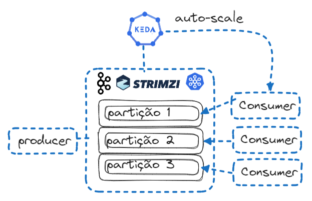

# Lab Eda - Keda Auto-Scaling data streaming

## Disclaimer
> **As configurações dos Laboratórios é puramente para fins de desenvolvimento local e estudos**
> 


## Pré-requisitos?
* Kubernets
* Operator Strimzi
* Operator Keda
* Intall kubectl
* Install Helm

# Instalação Kafka 

[LAB EDA](lab-eda//README.md)





## Inserindo o operator Strimzi
```
helm repo add strimzi https://strimzi.io/charts/
```

## Instalando o operator Strimzi

```
helm install strimzi-kafka strimzi/strimzi-kafka-operator
```

## Sudindo o cluster kafka 
```
cd keda
kubectl apply -f kafka.yaml
kubectl get kafka
```


## Inserindo o repositorio Keda
```
helm repo add kedacore https://kedacore.github.io/charts
helm repo update
```

## Instalando o keda 

```
helm install keda kedacore/keda
```

*Isso instalará o Operador KEDA e o servidor da API KEDA Metrics (como separado Deployment)*

```
kubectl get deployment 

kubectl get pods
```

# Deploy os componentes para Scale

Criando o tópico no cluster Kafka

```
kubectl apply -f kafka-topic.yaml
```


Criado o objeto responsável pelo scale do KEDA

```
kubectl apply -f kafka-scaledobject.yaml
```


Criando o consumer do kafka, que será com dimensionamento para 0

> `minReplicaCount` default 0, mais detalhes https://keda.sh/docs/2.10/concepts/scaling-deployments/

```
kubectl apply -f kafka-consumer.yaml
```


Criando o produtor kafka

```
kubectl apply -f kafka-producer.yaml
```

Testando o scale

```
kubectl get deployment -w
```

## Auto scaling

Quando o produtor envia mais mensagens do que o `lagThreshold` especificado no objeto dimensionado, KEDA faz uma escala de 0 a 1 para que um pod de consumidor Kafka comece a consumir mensagens.


Diminuindo ou acabando as mensagens do lag Kafka, após o `coolingDown` período  sem mensagem (5 minutos por padrão), o operador KEDA escalará o consumidor Kafka para apenas um pod como no início. Parando o produtor Kafka, o operador KEDA escalará o consumidor Kafka para 0.


