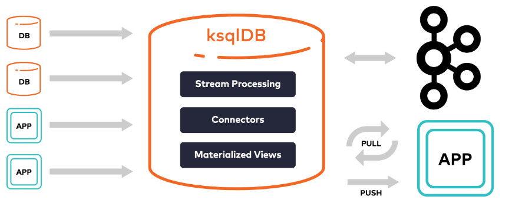

# Lab Eda - KSQLdb

---
## Disclaimer
> **As configurações dos Laboratórios é puramente para fins de desenvolvimento local e estudos**
> 

---

## Pré-requisitos?
* Docker
* Docker-Compose


---




# KSqldb


> [!IMPORTANT]
> Daqui por diante, no código que será executado no Terminal com `ksqldb` terá um a informação de ksqldb.

## Iniciando seus ambientes `kafka-broker`, `zookeeper`, `connect` e  `ksqldb-server ksqldb-cli`.

```bash
cd ambiente
docker compose up -d kafka-broker zookeeper  connect ksqldb-server ksqldb-cli 
```

Entrando no container e acessando o CLI do `ksqldb`

```bash
docker compose exec ksqldb-cli ksql http://ksqldb-server:8088
```


# Instalação Kafka 

# [Para configurar o ambiente do Kafka, consulte o laboratório dedicado ao Kafka](../../lab-kafka/README.md)


### Criando o tópico

Eu outro terminal crie um novo tópico

```bash
docker exec -it kafka-broker /bin/bash
kafka-topics --bootstrap-server localhost:9092 --create --partitions 1 --replication-factor 1 --topic alunos ;
```

No primeiro terminal, o  KSQL, execute os comandos abaixo: [ksqldb]

```bash
ksql> show topics;

ksql> list topics;
```

Volte para o terminal que criou o tópico para produzir as mensagens.

```bash
kafka-console-producer --bootstrap-server localhost:9092 --topic alunos --property parse.key=true --property key.separator=:

//key:value

>aluno:aluno 1
>aluno:aluno 2
>aluno:aluno 3
>aluno:aluno 4
```

No terminal com KSQLdb aberto. [ksqldb]

```bash
print 'alunos' from beginning;

print 'alunos' from beginning limit 2;

print 'alunos' from beginning interval 2 limit 2 ;

print 'alunos' from beginning interval 2 ;

```


### Criando nosso primeiro Stream

> No terminal do KSQLdb [ksqldb]

```bash
create stream alunos_stream (id int, nome varchar , curso varchar) with (kafka_topic='alunos', value_format='DELIMITED');

```


Listando o Stream [ksqldb]

```bash
list streams;
```


Descrevendo o Stream [ksqldb]

```bash
describe ALUNOS_STREAM;

```

Selecionando os dados [ksqldb]

```bash
select rowtime, id, nome, curso from ALUNOS_STREAM emit changes;
```

Em outro terminal

```bash

//Se não estiver dentro do container

docker exec -it kafka-broker /bin/bash

kafka-console-producer --bootstrap-server localhost:9092 --topic alunos --property parse.key=true --property key.separator=:

>aluno:1,aluno 1 ,arquitetura de dados
>aluno:2,aluno 2 ,engenharia de dados
>aluno:3,aluno 3 ,engenharia de dados
>aluno:4,aluno 4 ,arquitetura de dados
```

Formatando a data da query no terminal com KSQLdb aberto.[ksqldb]

```bash
select FORMAT_TIMESTAMP(FROM_UNIXTIME(rowtime), 'yyyy-MM-dd HH:mm:ss') as data , id, nome, curso from ALUNOS_STREAM emit changes;

```

Cade os dados ??

Terminal [ksqldb]
```bash
 //Configuração para ver todas as mensagens produzidas
 SET 'auto.offset.reset'='earliest';
```

Agrupando as mensagens

Terminal [ksqldb]
```bash
^C 
select curso, count(*) from ALUNOS_STREAM  group by curso emit changes;
```

Produzinho mais mensagens no outro terminal que já está aberto

```bash
>aluno:4,aluno 4 ,arquitetura de dados
```

No terminal  [ksqldb]

```bash
^C
select FORMAT_TIMESTAMP(FROM_UNIXTIME(rowtime), 'yyyy-MM-dd HH:mm:ss') as data , id, nome, curso from ALUNOS_STREAM emit changes limit 4;
```

### Criando seu stream no formato json

No Terminal

```bash
kafka-topics --bootstrap-server localhost:9092 --create --topic professores --partitions 1 --replication-factor 1
```

Terminal [ksqldb]

```bash
list topics;

create stream professores_stream (id int, nome varchar , materia varchar, quantidadeaula int) with (kafka_topic='professores', value_format='json');

show streams;

select rowtime, id, nome from professores_stream emit changes;

```


Terminal

```bash
kafka-console-producer --bootstrap-server localhost:9092 --topic professores --property parse.key=true --property key.separator=:

>professor1:{"id":1, "nome":"Fernando", "materia":"dados" , "quantidadeaula": 2}
>professor2:{"id":2, "nome":"Fabio", "materia":"dados", "quantidadeaula": 4}
>professor3:{"id":3, "nome":"Felipe", "materia":"dados", "quantidadeaula": 6}
```

### Funções escalares


> https://docs.ksqldb.io/en/latest/developer-guide/ksqldb-reference/scalar-functions/

Terminal [ksqldb]


```bash
select FORMAT_TIMESTAMP(FROM_UNIXTIME(rowtime), 'yyyy-MM-dd HH:mm:ss', 'America/Sao_Paulo') as data, id, nome from ALUNOS_STREAM emit changes;


select CAST(FROM_UNIXTIME(rowtimE) AS DATE) as data, id, nome from ALUNOS_STREAM emit changes;


select CAST(FROM_UNIXTIME(rowtimE) AS DATE) as data, id, ucase(nome) as nome from ALUNOS_STREAM emit changes;


```

---

### Visões Stream


Criando uma consulta baseada em um stream.

Terminal [ksqldb]


```bash

SET 'auto.offset.reset'='earliest';


select  id, 'Professor: ' + ucase(nome) + ' de ' + materia 
+ ' , a quantidade de matéria é: '
+ case when quantidadeaula <= 2  then 'Bom'
       when quantidadeaula between 3 and 5 then 'Ótimo'
       else 'Excelente' 
   end as descricao
from professores_stream;

```

Executando o script e criando a view.

```bash
run script '/scripts/view_professores_stream.ksql';

show streams;


```

No terminal do Linux crie mais uma mensagem


```bash
professor4:{"id":4, "nome":"Maria", "materia":"dados", "quantidadeaula": 8}
```

Terminal [ksqldb]


```bash
describe view_professores_stream extended;

select descricao from view_professores_stream emit changes;
  
```

No outro terminal crie mais uma mensagem


```bash
professor5:{"id":5, "nome":"Maria", "materia":"dados", "quantidadeaula": 10}

```

Observe o tópico criado

```bash
kafka-topics --bootstrap-server localhost:9092 --list 
```

Aplicando um consumer no tópico `VIEW_PROFESSORES_STREAM`

```bash
kafka-console-consumer --bootstrap-server localhost:9092 --topic VIEW_PROFESSORES_STREAM --from-beginning
```

Apagando o stream 

Terminal [ksqldb]

```bash
 drop stream VIEW_PROFESSORES_STREAM;
```

---

## Tabelas


No terminal Linux vamos criar nosso topico para trabalhar com tabelas

```bash
kafka-topics --bootstrap-server localhost:9092 --create --partitions 1 --replication-factor 1 --topic produto ;

```

Terminal [ksqldb] criar a tabela `produtosTable`

```bash
create table produtosTable (idProduto int primary key, produto varchar) with (KAFKA_TOPIC='produto', KEY_FORMAT = 'JSON',
  VALUE_FORMAT = 'JSON');

show tables;

describe produtosTable;

describe  produtosTable extended;

select idProduto, produto from produtosTable emit changes;

```

No terminal Linux, vamos criar algumas mensagens

```bash
kafka-console-producer --bootstrap-server localhost:9092 --topic produto --property parse.key=true --property key.separator=:

>1:{"produto":"Celular"}
>2:{"produto":"TV"}
>3:{"produto":"Geladeira"}
>4:{"produto":"Maquina"}
```


Terminal [ksqldb]

```bash
 select * from PRODUTOSTABLE where idproduto= 2  emit changes;
```

No terminal Linux, vamos alterar a mensagem 2

```bash
>2:{"produto":"TV - Alterada"}

^C
kafka-consumer-groups --bootstrap-server localhost:9092 --list

//Verifica se tem o topico *PRODUTOSTABLE*KsqlTopic*


 kafka-console-consumer --bootstrap-server localhost:9092 --topic _confluent-ksql-default_transient_transient_PRODUTOSTABLE_8009244719463908702_1719781776330-KsqlTopic-Reduce-changelog --property print.timestamp=true --property print.key=true --property print.value=true --property print.partition=true --from-beginning


//Listando as configurações do topico 

kafka-topics --bootstrap-server 127.0.0.1:9092 --describe --topic _confluent-ksql-default_transient_transient_PRODUTOSTABLE4_2388878536066455653_1689963843486-KsqlTopic-Reduce-changelog --describe


drop table IF EXISTS produtosTable DELETE TOPIC;

```


### Joins Ksqldb

> Stream podem fazer join com Stream
  Stream com Stream gera um novo stream
  Table com Table gera uma nova table
  Stream com Table gera um novo Stream


Criando um topico para preço no terminal Linux


```bash
kafka-topics --bootstrap-server localhost:9092 --create --topic produto-preco --partitions 1 --replication-factor 1

```

Criando o stream para os preços dos produto no Terminal [ksqldb]


```bash
create stream produto_preco_stream (idprodutopreco int, idproduto int,  preco decimal(18,2)) with (kafka_topic='produto-preco', value_format='json');

```

Criando Join Stream x Table

Terminal [ksqldb]

```bash
select p.idproduto, p.PRODUTO, pp.preco
from produto_preco_stream pp 
left join PRODUTOSTABLE p on pp.idproduto=p.idproduto emit changes;
```

Criando mensagens no topico de preço no terminal

```bash
kafka-console-producer --bootstrap-server localhost:9092 --topic produto-preco --property parse.key=true --property key.separator=:

>1:{"idprodutopreco":1,"idproduto":1, "preco": 1.99}
>2:{"idprodutopreco":2,"idproduto":2, "preco":10}
>3:{"idprodutopreco":3,"idproduto":3, "preco":1500}

```

Invertendo o join...Terminal [ksqldb]

```bash
select pp.idproduto, pp.PRODUTO, p.preco
from PRODUTOSTABLE  pp 
left join produto_preco_stream p on pp.idproduto=p.idproduto emit changes;
```
> Opa!!!!!!!!!
>Invalid join order: table-stream joins are not supported; only stream-table joins.


Criando um um Stream do join

Terminal [ksqldb]

```bash
create stream produto_com_precos as 
select p.idproduto, p.PRODUTO, pp.preco
from produto_preco_stream pp 
left join PRODUTOSTABLE p on pp.idproduto=p.idproduto emit changes;

select P_IDPRODUTO, produto , preco from produto_com_precos  emit changes;
```


--------


 ### Formatos Ksqldb

 * NONE
 * DELIMITED (csv)
 * JSON
 * AVRO
 * KAFKA
 * PROTOBUF


## Planos de execução

#Explain Plan

```bash
show queries;
explain (id-query) 

 ```

 >Visualizando o plano de execução
 https://zz85.github.io/kafka-streams-viz/