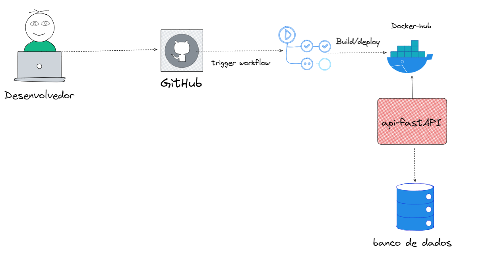

# LAB Fast API
---
## Disclaimer
> **Esta configuração é puramente para fins de desenvolvimento local e estudos**
> 

---

## Pré-requisitos?
* Docker
* Docker-Compose
* Editor de códigos como VSCode, Sublime, Vim
* Python 3.9
---

Para o nosso exercícios vamos criar um repositório para versionar nossos arquivos.

## Criando um repositório, lembra da aula de Devops?

Acesse a página do github e clique em “Create Repository”

1. Coloque o nome do repositorio de sua preferencia;
2. Informe uma descrição para o repositório;
3. Configure o mesmo como privado ou público. > Um repositório privado só é acessivel
pelo seu usuário e os colaboradores do mesmo, o público tem seu código acessivel por
toda internet;
4. Clique em Create Repository.

# [Clique aqui e reveja como criar respositorio no Git no LAB Devops](../lab-devops/README.md)

## FastAPI

FastAPI é um framework web moderno e rápido (alto desempenho) para a construção de APIs com Python. Ele é desenhado para criar APIs da web de maneira rápida e fácil, com foco em alta performance, facilidade de uso e documentação automática.

### Principais características do FastAPI:

* Rápido: O desempenho do FastAPI é comparável ao do Node.js e do Go (graças ao Starlette e Pydantic).
* Fácil de usar: Minimiza o código repetitivo e facilita a criação de endpoints de API.
* Documentação automática: Gera documentação interativa automaticamente com Swagger UI e ReDoc.

## O Projeto

Estamos desenvolvendo um projeto utilizando FastAPI, uma framework web moderna e de alto desempenho para a construção de APIs com Python 3.9+ baseada em padrões como OpenAPI e JSON Schema. Este projeto começará com a implementação de um simples "Hello World" para familiarizarmos com a tecnologia.

1. [Minha Primeira API](minha-primeira-api/README.md)
2. [Um poouco mais sobre RestFull](app-restfull/README.md)
3. [Vamos melhorar um pouco](app-restfull-refactor/README.md)
4. [FastAPI e Esteira GitAction](app-gitaction/README.md)
5. [FastAPI e Postgresql](app-crud-db/README.md)

