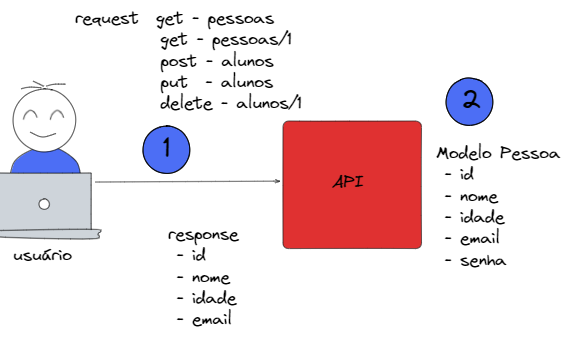

# LAB Fast API
---
## Disclaimer
> **Esta configuração é puramente para fins de desenvolvimento local e estudos**
> 

---

## Pré-requisitos?
* Docker
* Docker-Compose
* Editor de códigos como VSCode, Sublime, Vim
* Python 3.10
---

## Padrões Restfull




Vamos criar um arquivo `setup.py`

 ### Linux
```bash
touch setup.py
```

 ### Powershell
```powershell
$null | Out-File -FilePath "setup.py" -Encoding utf8
```

### Editaremos o arquivo `setup.py` 


```python

import io
import os
from setuptools import find_packages, setup


def read(*paths, **kwargs):
    content = ""
    with io.open(
        os.path.join(os.path.dirname(__file__), *paths),
        encoding=kwargs.get("encoding", "utf8"),
    ) as open_file:
        content = open_file.read().strip()
    return content


def read_requirements(path):
    return [
        line.strip()
        for line in read(path).split("\n")
        if not line.startswith(('"', "#", "-", "git+"))
    ]

setup(
    name="FastFIA",
    version="0.1.0",
    description="Minha API",
    url="fia.io",
    python_requires=">=3.8",   
    author="Seu nome",
    packages=find_packages(exclude=["tests"]),
    include_package_data=True,
    install_requires=read_requirements("requirements.txt")     
)

```

### Editaremos o arquivo `requirements.txt` e adicionaremos mais bibliotecas


```plain
fastapi
pydantic
```


### Alterando  o arquivo `app/main.py`

```python
from pathlib import Path
from typing import Annotated, Any, List, Optional
from fastapi import FastAPI,HTTPException, status
from pydantic import BaseModel, EmailStr

app = FastAPI(
    title="Fast Api Fia",
    version="0.1.0",
    description="Minha api",
)

ALUNOS = [
    {"id": 1, "nome": "Pedro", "idade": 10, "email": "pedro@gmail.com", "senha": "1234"},
    {"id": 2, "nome": "Paulo", "idade": 20, "email": "paulo@gmail.com", "senha": "1234"},
    {"id": 3, "nome": "Gabriel", "idade": 35, "email": "gabriel@gmail.com", "senha": "1234"},
    {"id": 4, "nome": "Maria", "idade": 18, "email":"maria@gmail.com", "senha": "1234"}
]

class AlunoResponse(BaseModel):
  id: int
  nome: str 
  idade: Optional[int] = None
  email: EmailStr

class AlunoRequest(BaseModel):
  id: int
  nome: str 
  idade: Optional[int] = None
  email: EmailStr
  senha: str


@app.get("/")
async def home():
    return "Olá alunos"


@app.get("/alunos/", response_model=List[AlunoResponse], status_code=status.HTTP_200_OK)
async def Alunos()-> Any:
    return ALUNOS


@app.get("/alunos/{idAluno}", response_model=AlunoResponse, status_code=status.HTTP_200_OK)
async def Consultar_Aluno(idAluno: Annotated[int, Path(title="O ID do aluno para a consulta", ge=1)]) -> Any:
      for item in ALUNOS:
        if item["id"] == idAluno:
            return item
      raise HTTPException(status_code=status.HTTP_404_NOT_FOUND, detail="Aluno não encontrado")
      

@app.post("/alunos", response_model=AlunoResponse, status_code=status.HTTP_201_CREATED)
# async def Inserir_Aluno(aluno: str):
async def Inserir_Aluno(aluno: AlunoRequest)-> Any:
  for _aluno in ALUNOS:
        if _aluno["id"] == aluno.id:
            raise HTTPException(status_code=status.HTTP_400_BAD_REQUEST, detail="Já existe um aluno com esse ID")
        
  ALUNOS.append(aluno.dict())
 
  return aluno
  

@app.put("/alunos/{idAluno}", response_model=AlunoResponse,  status_code=status.HTTP_200_OK)
async def Atualizar_Aluno(idAluno:int, aluno: AlunoRequest) -> Any:
 for _aluno in ALUNOS:
        if _aluno["id"] == aluno.id:
            _aluno["nome"] = aluno.nome
            _aluno["idade"] = aluno.idade
            _aluno["email"] = aluno.email
            _aluno["senha"] = aluno.senha
            
            return _aluno
 raise HTTPException(status_code=status.HTTP_404_NOT_FOUND, detail="Aluno não encontrado")


@app.delete("/alunos/{idAluno}", response_model=AlunoResponse, status_code=status.HTTP_200_OK)
async def Deletar_Aluno(idAluno: int) -> Any:
    for index, alnno in enumerate(ALUNOS):
        if alnno["id"] == idAluno:
            return ALUNOS.pop(index)
    raise HTTPException(status_code=status.HTTP_404_NOT_FOUND, detail="Aluno não encontrado")


```


Atualizando a imagem da nossa aplicação

```bash
docker image build -t <<seu usuario>>/app-fastapi-fia .

```


Execute o container para testar

```console

docker container run -d --name fast-api-fia -p 80:80  <<seu usuario>>/app-fastapi-fia

docker logs  fast-api-fia

```


Acesse os endereços:

* http://localhost/docs
* http://localhost/openapi.json
* http://localhost/redoc


3. [Vamos melhorar um pouco](app-restfull-refactor/README.md)
4. [FastAPI e Esteira GitAction](app-gitaction/README.md)
5. [FastAPI e Postgresql](app-crud-db/README.md)
