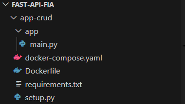

# LAB Fast API
---
## Disclaimer
> **Esta configuração é puramente para fins de desenvolvimento local e estudos**
> 

---

## Pré-requisitos?
* Docker
* Docker-Compose
* Editor de códigos como VSCode, Sublime, Vim
* Python 3.10
---

## Minha Primeira AP

//criando a estrutura de pastas



### Linux
```bash
mkdir app
touch app/main.py
touch Dockerfile
touch requirements.txt
```
 
 ### Powershell
```powershell
mkdir app

$null | Out-File -FilePath "app/main.py" -Encoding utf8
$null | Out-File -FilePath "Dockerfile" -Encoding utf8
$null | Out-File -FilePath "requirements.txt" -Encoding utf8

```

```
.
├── Dockerfile           #Arquivo onde será gerado a imagem
├── app                  #Pasta da aplicação FastApi
│   └── main.py          #Arquivo aplicação FastApi 
└── requirements.txt     #Bibliotecas das depedencias das aplicação
```

### Editaremos o arquivo `requirements.txt` e adicionaremos


```plain
fastapi
```

### Editando o arquivo `app/main.py`


```python
from fastapi import FastAPI

app = FastAPI()

@app.get("/")
def read_root():
    return {"Hello": "World"}

```

Editar o arquico `Dockerfile`

```docker
FROM python:3.9

WORKDIR /code

COPY ./requirements.txt /code/requirements.txt

RUN pip install --no-cache-dir --upgrade -r /code/requirements.txt

COPY ./app /code/app

CMD ["fastapi", "run", "app/main.py", "--port", "80"]

```

> [!IMPORTANTE]
> Não esqueçam de mudar para o usuário do DockerHub de vocês.

Criando a imagem da nossa aplicação

```bash
docker image build -t <<seu usuario>>/app-fastapi-fia .

```


Execute o container para testar

```console

docker container run -d --name fast-api-fia -p 80:80  <<seu usuario>>/app-fastapi-fia

docker logs  fast-api-fia

```

Acesse os endereços:

* http://localhost/docs
* http://localhost/openapi.json
* http://localhost/redoc

