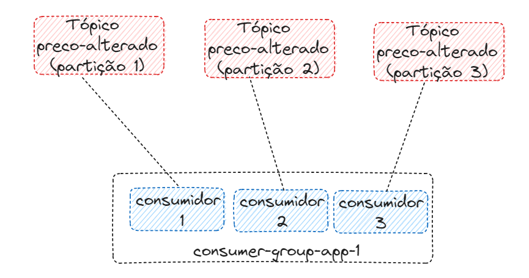

# LAB KAFKA

---
## Disclaimer
> **Esta configuração é puramente para fins de desenvolvimento local e estudos**
> 

---


## Pré-requisitos?
* Docker
* Docker-Compose

---

## Criando o ambiente Kafka com o docker compose

No diretório `/lab-kafka` execute o comando abaixo
```
docker-compose up -d
```

Verificando se os containers foram criados com sucesso

```
 docker container ls
```
Verificando as imagens que foram feitas download do docker-hub
```
 docker image ls
```

Verificando se a ferramenta Kafdrop realizou o deploy com sucesso
http://localhost:19000/

>Kafdrop é uma interface de usuário da web simples, para visualizar tópicos Kafka e navegar em grupos de consumidores. A ferramenta exibe informações como corretores, tópicos, partições, consumidores e permite visualizar mensagens.

---

Vamos executar alguns comandos de dentro do container kafka1

Acessar o Shell do container kafka1

```
docker exec -it kafka1 /bin/bash
```

# Criando nosso Primeiro tópico
```
kafka-topics --bootstrap-server localhost:9092 --topic alunos --create
```

Listando o tópico criado
```
kafka-topics --bootstrap-server localhost:9092 --list 
```

Alguém lembra das partições? Agora o tópico com mais de uma partição

```
kafka-topics --bootstrap-server localhost:9092 --topic alunos-novos --create --partitions 3
```
Esqueceu a configuração do tópico?

```
kafka-topics --bootstrap-server localhost:9092 --topic alunos-novos --describe
```

... e com fator de replicação

```
kafka-topics --bootstrap-server localhost:9092 --topic alunos-novos-factor --create --partitions 3 --replication-factor 2
```
...é não deu certo, porque ?

Agora vai dar certo...
```
kafka-topics --bootstrap-server localhost:9092 --topic alunos-novos-factor --create --partitions 3 --replication-factor 1
```

# Deletando um tópico

```
kafka-topics --bootstrap-server localhost:9092 --topic alunos-novos-factor --delete
kafka-topics --bootstrap-server localhost:9092 --topic alunos-novos-factor --describe

```

# Produzinho mensagens

```
kafka-console-producer --bootstrap-server localhost:9092 --topic alunos

> Minha primeira mensagem
>Melhor lab do brasil
>Eu sou o Fulano
>^C  (<- Ctrl + C is used to exit the producer)

```

Produzinho mensagens com acks

```
kafka-console-producer --bootstrap-server localhost:9092 --topic alunos --producer-property acks=all
```

Criando o tópico no momento de criar a mensagem

```
kafka-console-producer --bootstrap-server localhost:9092 --topic professor

kafka-topics --bootstrap-server localhost:9092 --topic professor --describe

```

> A Criação do tópico foi possivel pois a propriedade auto.create.topics.enable está com true.

O tópico foi criado com configurações default

Ver as configurações na pasta cat /etc/kafka/server.properties

Produzir mensagens com habilitando a Key

```
kafka-console-producer --bootstrap-server localhost:9092 --topic alunos --property parse.key=true --property key.separator=:
>key:value
>aluno:fernando
```

# Consumindo mensagens

```
kafka-console-consumer --bootstrap-server localhost:9092 --topic alunos
```

Abre outro terminal, entre no container e produza uma mensagem

```

//Entrando no containar em outro terminal

docker exec -it kafka1 /bin/bash

//Produzindo mensagens

kafka-console-producer --bootstrap-server localhost:9092 --topic alunos --property parse.key=true --property key.separator=:

>aluno:fernando
>aluno:felipe

```

Consumindo as mensagens desde o inicio

No primeiro terminal cancela o consumo da mensagem

```
>^C  (<- Ctrl + C is used to exit the producer)

kafka-console-consumer --bootstrap-server localhost:9092 --topic alunos --from-beginning

```

Consumindo mensagens mostrado algumas configurações como a key e value

```
kafka-console-consumer --bootstrap-server localhost:9092 --topic alunos  --property print.timestamp=true --property print.key=true --property print.value=true --property print.partition=true --from-beginning

>^C  (<- Ctrl + C is used to exit the producer)

```

# Consumer group


Criando um consumer group

Consumindo as mensagens com um consumer group

```
kafka-console-consumer --bootstrap-server localhost:9092 --topic alunos --group aplicacao-lab
```

Em um outro terminal....

Produzindo as mensagem 

```
kafka-console-producer --bootstrap-server localhost:9092  --topic alunos
>nome:fernando
```

Listando os consumer groups em outro terminal

```
docker exec -it kafka1 /bin/bash
kafka-consumer-groups --bootstrap-server localhost:9092 --list
```

As configurações do consume groups são :

```
kafka-consumer-groups --bootstrap-server localhost:9092 --describe --group aplicacao-lab

```

Produzindo mensagem no Round Robin Partitioner

```
kafka-console-producer --bootstrap-server localhost:9092 --producer-property partitioner.class=org.apache.kafka.clients.producer.RoundRobinPartitioner --topic alunos
```
---

## Praticando mais - Desafio




O desafio tera a estrutura da imagem acima:

- Um tópico com nome preco-alterado com 3 partições
- Um consumer group com 3 consumidores


> Crie o tópico com a opção `RoundRobinPartitioner` para simular as mensagens em cada consumidor


# Remover os containers

```
exit
docker-compose down
```
