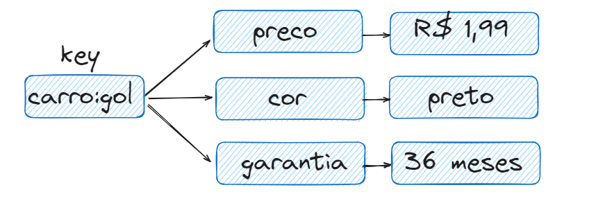
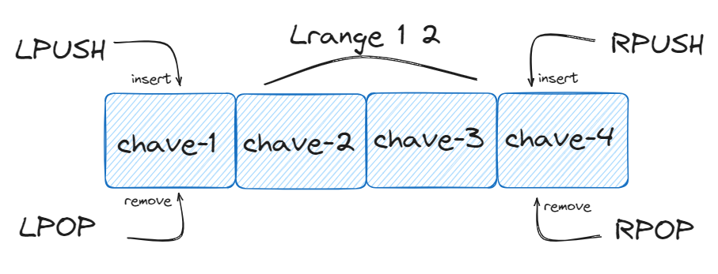
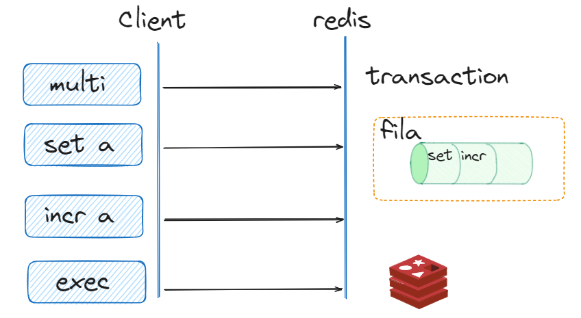
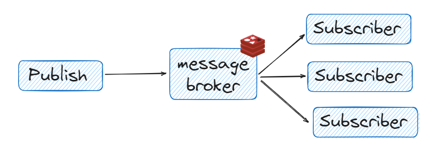

# LAB REDIS

## Disclaimer
> **Esta configuração é puramente para fins de desenvolvimento local e estudos**


O Arquivo `docker-compose` provisiona o Redis e Interface Web para acesso ao redis


## Pré-requisitos?
* Docker
* Docker-Compose


## Executando Redis e UI

```sh
docker-compose up -d
```


Deu tudo certo ?

```sh
docker container ls
```

## Acesso WebUI do Redis Insight 


* http://localhost:8001/


Acessando o client que está no container do Redis para acessar o cluster

```sh
docker exec -it redis /bin/bash

redis-cli -h 127.0.0.1 -p 6379 -a "labdata"
```

Set Armazena a chave e seu valor, caso já exista, seu valor é atualizado

```sh
set aluno-1 pedro

set aluno-1 joao

get aluno-1

set aluno-2 maria

get aluno-2
```

O MSet Armazena multiplos de chave e valor, caso já exista, seu valor é atualizado

```sh
mset mega-sena-dia-1 1,2,3, mega-sena-dia-2 3,4,5

mget mega-sena-dia-1  mega-sena-dia-2

```

APPEND Inseri o conteúdo no final de string

```sh
APPEND aluno-1  " da silva "

GET aluno-1

```


## Procurando as chaves

Key busca as chaves do Redis por um determinado padrão (patthern), informado como parâmetro

```sh
keys *

keys aluno*

```

* Caractere *, representa conjuntos de caracteres
* Caractere ? representa um caractre
* Caractere [], representa um grupo caracteres Ex. [ab]


SCAN Permite iteração incremental, retornando apenas um pequeno número de elementos por chamada

```sh
scan 0

scan 0 MATCH *mega*
```

A chamada usa o zero como cursor para iniciar a iteração.
Como você pode ver, o valor de retorno SCAN é um array de dois valores: o primeiro valor é o novo cursor a ser usado na próxima chamada, o segundo valor é um array de elementos.

O Scan pode ser combinado com outros comandos

```sh
scan 0 MATCH *mega*
```


## Deletando a chave com DEL
```sh
del aluno-1
```

## UNLINK Desvincula a chave e apaga depois de forma assincrona.

```sh
UNLINK mega-sena-dia-1

```


## Expiração de Chaves 

Criar uma chave já com o tempo de expiração

```sh
set aluno-10 Paulo EX 50

ttl aluno-10
```

Retorno do TTL -2 chave não existente, -1 Chave sem tempo de expiração

Adicionando um tempo de expiração em uma chave criada


```sh
expire aluno-10 100

ttl aluno-10
```

Removendo a chave de expiração


```sh
persist aluno-10

ttl aluno-10
```

## Usuários onlines

```sh
incr pagina-usuario

get pagina-usuario

incr pagina-usuario

get pagina-usuario

get pagina-usuario

decr pagina-usuario

get pagina-usuario
```

Criando pontos de incrementos

```sh
incrby pontos-usuario-1 2
decrby pontos-usuario-1 3

```

E se for incrementar texto com número ?

```sh
set jogador-goleiro Pedro

incr jogador-goleiro

////(error) ERR value is not an integer or out of range

object encoding jogador-goleiro
```


## Hashes

Hash são mapas que contem campos e valores do tipo string (texto), muito usando para representar um conjunto de informações

Cada hash pode ter mais de 4 bilhões de pares
* Nome
* E-mail
* Endereço
* ..




```sh

del aluno-10
hset aluno-10 nome fabio rua "av paulista" idade 30

hexists aluno-10 idade

hget aluno-10 idade

//Se buscar um campo que não existe
hget aluno-10 bairro

//A cada ano o Fabio faz aniversário
 HINCRBY aluno-10 idade 1

HDEL aluno-10 rua


//Só se o campo existir
HSETNX aluno-10 idade 25

hget aluno-10 idade

//Voltando o campo Rua
hset aluno-10 rua "av paulista"


//Listando todos os campos
hgetall aluno-10

//Buscando somente os nomes que eu quero 
HMGET aluno-10 nome idade

//Quais campos possuem na chave
HKEYS aluno-10 

//Usanco o HSCAN para buscar todos os campos que tenha o inicio do campo como prof
hset aluno-10 profissao "Engenheiro de dados" professor "Pedro"

hgetall aluno-10

hscan aluno-10 0 match prof*


```


## Listas

* São ordenadas
* São permitidas duplicidades
* Itens podem ser adicionados no começo ou no fim




```sh
lpush lista-de-compra-maria arroz feijão carne batata alface

llen lista-de-compra-maria

lrange lista-de-compra-maria 1 3

lrange lista-de-compra-maria 0 -1

rpush lista-de-compra-maria ovo

lrange lista-de-compra-maria 0 -1

//Tira a alface

lpop lista-de-compra-maria

lrange lista-de-compra-maria 0 -1

//Ah não tira, tira o ovo, rs

rpop lista-de-compra-maria

lrange lista-de-compra-maria 0 -1

lindex lista-de-compra-maria 0


//Troca a batata por agua
LSET lista-de-compra-maria 0 agua

lrange lista-de-compra-maria 0 -1


```

## Transações



```sh
multi

set produto-2024 caderno

get produto-2024


exec
```

Testando transações em outras sessões

```sh
//Sessão client 1 no terminal 1

multi

set produto-2024 produto-alterado

//Abrir outro terminal para o client 2

docker exec -it redis /bin/bash

redis-cli -h 127.0.0.1 -p 6379 -a "labdata"

get  produto-2024

//Agora voltando para o terminal 1

exec

//No terminal 2, podemos obervar o valor da chave produto-2024 foi alterado
get  produto-2024


```

## WATCH

> Chaves são monitoradas para detectar alterações nelas. 
Se pelo menos uma chave monitorada for modificada antes do comando  EXEC, toda a transação será abortada e quando o comando exec for chamado, 
retornará uma resposta null para notificar que a transação falhou.


```sh

//Terminal 1

WATCH produto-2024
 multi

 set produto-2024 produto

 //Terminal 2
  set produto-2024 produto-terminal-2


//Terminal 1
exec
 get produto-2024

```

## Publish-Subscribe




```sh
//No terminal 1
subscribe ConcessionariaBMW-A-TemX1

//No terminal 2
publish ConcessionariaBMW-A-TemX1 sim

//E se eu ligar para mais de uma concessenaria

//Ctrl + C
//No terminal 1
psubscribe ConcessionariaBMW*

//No terminal 2
publish ConcessionariaBMW-A-TemX1 sim

//No terminal 3

docker exec -it redis /bin/bash

redis-cli -h 127.0.0.1 -p 6379 -a "labdata"

publish ConcessionariaBMW-B-TemX1 nao


```

